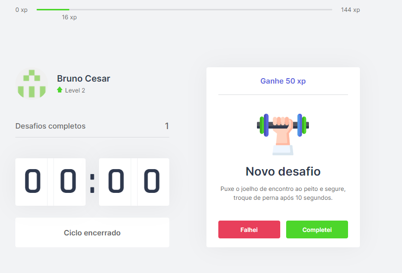

# Projeto Moveit.


## Descrição do Projeto
<p>Projeto desenvolvido ultilizando a técnica de pomodoro, que consiste voce trabalhar/estudar por 25 minutos e tirar 5 minutos para fazer algum exercício, o moveit irá te ajudar nisso, desenvolvido duarate a NLW, treinamento da Rocketseat.</p>


<h4> 
	✅  Status: Concluído.
</h4>

<h2>Demonstração da aplicação</h2>

<div>
  
  
  
</div>


## Pré-requisitos

<p>
Antes de começar, você vai precisar ter instalado em sua máquina as seguintes ferramentas:
<strong>Github</strong> <a>https://git-scm.com</a>, <strong>Nodejs</strong> <a>https://nodejs.org/en/</a>, <strong>Yarn</strong>(opcional) <a>https://yarnpkg.com/</a>. 
Além disto é bom ter um editor para trabalhar com o código como <strong>VSCode</strong> <a>https://code.visualstudio.com</a>
<p>

## 🎲 Rodando o Front End 

```bash
# Clone este repositório
$ git clone <https://github.com/Bruno-Cesar123/moveit>

# Acesse a pasta do projeto no terminal/cmd
$ cd moveit-next

# Instale as dependências
$ npm install ou yarn 

# Execute a aplicação em modo de desenvolvimento
$ npm run dev ou yarn dev

# O servidor inciará na porta:3000 - acesse <http://localhost:3000>
```


## 🛠 Tecnologias 

<p>As seguintes ferramentas foram usadas na construção do projeto:</p>

<div>
  <ul>
    <li style="list-style: none"> <strong>Node.js</strong> <a>https://nodejs.org/en/</a></li>
    <li style="list-style: none"> <strong>React</strong> <a>https://pt-br.reactjs.org/</a></li>
    <li style="list-style: none"> <strong>Typescript</strong> <a>https://www.typescriptlang.org/</a></li>
    <li style="list-style: none"> <strong>Next</strong> <a>https://nextjs.org/</a></li>
  </ul>
</div>

## 📝 Licença

<p>Este projeto esta sobe a licença MIT.</p>

<p>Feito por <strong>Bruno Cesar</strong> <a href="https://www.linkedin.com/in/bruno-cesar-b0039715a/">Linkedin</a>
